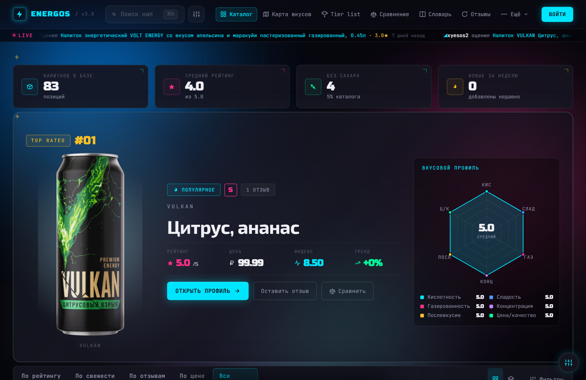
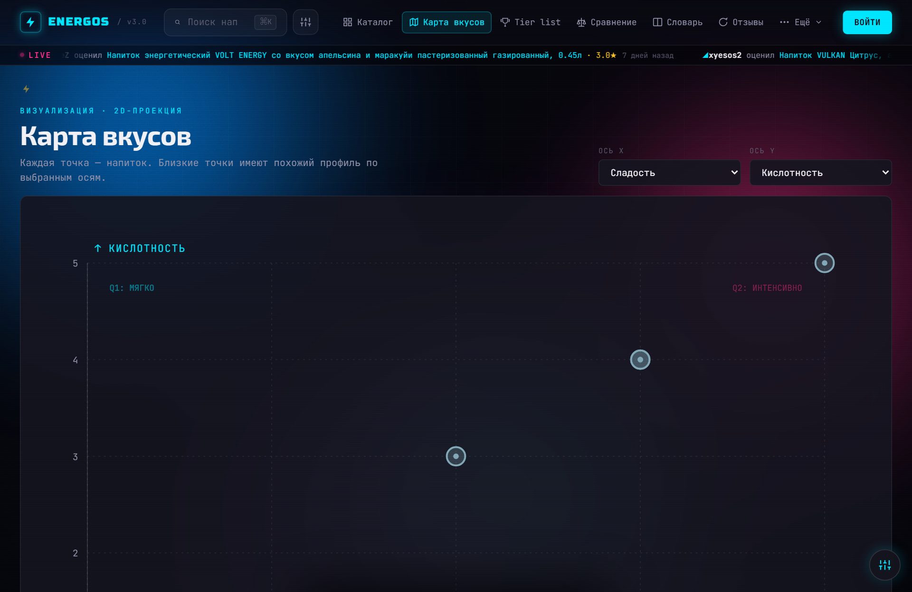
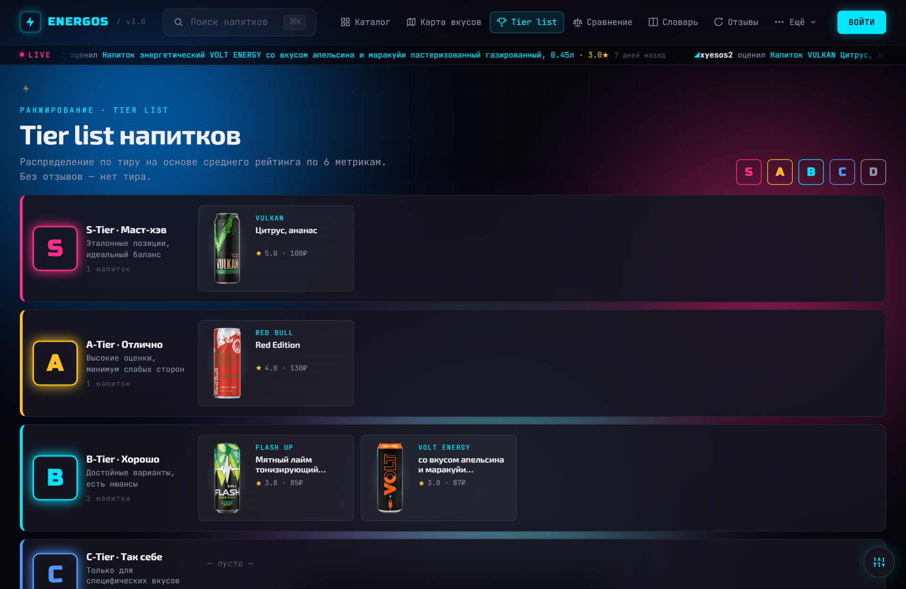

# Energos — Energy Drink Rating Website

> Сайт рейтинга энергетических напитков / Energy drink review & ranking platform

[](https://github.com/So77eZ/energos/actions/workflows/ci.yml)
[](https://github.com/So77eZ/energos/actions/workflows/codeql.yml)
[](LICENSE)

**Быстрый старт:** `docker compose up -d --build` · [Как контрибьютить](.github/CONTRIBUTING.md) · [Доска задач](https://github.com/users/So77eZ/projects/1)

---

## Скриншоты



| Карта вкусов | Тир-лист |
| --- | --- |
|  |  |

---

## Оглавление / Table of Contents

- [Скриншоты](#скриншоты)
- [Обзор](#обзор)
- [Основные цели](#основные-цели)
- [Структура сайта](#структура-сайта)
- [Поля данных](#поля-данных)
- [Визуальный рейтинг](#визуальный-рейтинг)
- [Система отзывов](#система-отзывов)
- [Геймификация](#геймификация)
- [Персонализация (TweaksPanel)](#персонализация-tweakspanel)
- [Функции администратора](#функции-администратора)
- [UI / Дизайн](#ui--дизайн)
- [Технологии](#технологии)
- [Цель проекта](#цель-проекта)

---

## Обзор

Energos — платформа для просмотра и ранжирования энергетических напитков. Пользователи могут просматривать визуальный каталог напитков, сравнивать их вкусовые характеристики и читать отзывы сообщества.

Акцент проекта — **визуальное сравнение**, **пользовательские отзывы** и **чёткие метрики вкуса**.

---

## Основные цели

- Предоставить наглядную систему ранжирования напитков
- Визуально отображать вкусовые характеристики и метрики
- Позволить пользователям добавлять и читать отзывы
- Дать администраторам инструменты управления каталогом и отзывами
- Представлять информацию в современном плиточном интерфейсе

---

## Структура сайта

### Главная страница — Каталог напитков (`/`)

Отображает все напитки в адаптивной сетке карточек с бесконечной подгрузкой (infinite-reveal с восстановлением позиции при возврате).

Каждая карточка включает:

- Фото напитка
- Название
- Цену
- Средний рейтинг (0–5)
- Отметку «Без сахара» (при наличии)
- Кнопку «в избранное» (для авторизованных)

Управление выдачей:

- **Сортировка** — по названию / рейтингу / цене (`SortBar`).
- **Переключатель вида** — сетка карточек ↔ тепловая карта «напиток × метрика» (heatmap-view).
- **Фильтр-поповер** — чипы тиров S/A/B/C/D, dual range-slider цены, тогглы «Без сахара» и «Только новые»; счётчик активных фильтров.
- **Поиск** — токенный, не зависит от порядка слов; состояние сортировки/фильтров синкается в URL.

### Страница напитка (`/drinks?id=…`)

Динамическая страница для каждого напитка. Содержит:

- Изображение и название напитка
- Оценку администратора по метрикам
- Среднее значение пользовательских оценок
- Собственный отзыв текущего пользователя (администратор видит свой отзыв с пометкой «Ваш администраторский отзыв»)
- Отзывы других пользователей с пагинацией, фильтром по оценке/периоду и emoji-реакциями
- Боковую панель с похожими по вкусовому профилю напитками
- 404-страницу при несуществующем `id`

### Карта вкусов (`/taste-map`)

Радарная/scatter-диаграмма для визуального сравнения вкусовых профилей напитков. Оси X/Y выбираются из всех 6 метрик.

### Сравнение (`/compare`)

Side-by-side сравнение напитков по метрикам: бары значений, золотая обводка победителя по каждой метрике, тоггл «Только различающиеся».

### Тир-лист (`/tier`)

Группировка напитков по тирам S/A/B/C/D (`tierFromRating`).

### Словарь / Sommelier (`/glossary`)

Справочник энергетических терминов и метрик с примерами напитков.

### Заявки на добавление (`/submit`)

Форма заявки на добавление напитка в каталог (название, цена, «Без сахара», фото). Заявки модерируются администратором (вкладка в админ-панели). Статусы: pending / approved / rejected, с причиной отклонения.

### Профиль пользователя (`/profile`)

- Список всех оставленных отзывов. При нажатии «Добавить» и выборе напитка форма отзыва открывается автоматически.
- **Достижения** — таб с прогрессом по бейджам (см. [Геймификация](#геймификация)).
- **Calendar heatmap** — GitHub-style сетка активности по отзывам за 12 месяцев.
- **Оформление** — таб настроек темы/акцента/шрифта/эффектов (тот же контент, что в TweaksPanel).
- Свои заявки на добавление с их статусами.

### Управление (Admin)

Панель для добавления, редактирования и удаления напитков (загрузка изображения через file-upload прямо в форме), модерации отзывов и заявок на добавление, просмотра лидеров.

---

## Поля данных

Каждый напиток содержит:

| Поле | Тип | Описание |
| --- | --- | --- |
| `name` | string | Название |
| `image_url` | string | URL изображения (заполняется через upload) |
| `price` | float | Цена |
| `no_sugar` | boolean | Флаг «Без сахара» |
| `acidity` | 1–5 | Кислотность |
| `sweetness` | 1–5 | Сладость |
| `concentration` | 1–5 | Концентрация / интенсивность |
| `carbonation` | 1–5 | Газированность |
| `aftertaste` | 1–5 | Сила послевкусия |
| `price_quality` | 1–5 | Соотношение цена/качество |
| `rating` | float | Средний балл (вычисляется) |

---

## Визуальный рейтинг

Метрики вкуса отображаются в виде точечных индикаторов (5 точек на каждую метрику) с цветовой кодировкой по типу показателя.

Карта вкусов использует радарную scatter-диаграмму для сравнения профилей напитков по осям кислотность / сладость.

---

## Система отзывов

Каждый зарегистрированный пользователь может оставить один отзыв на напиток и в дальнейшем его редактировать.

Каждый отзыв включает:

- Оценки по всем метрикам (1–5)
- Общую оценку (1–5)
- Дату публикации / дату редактирования

Администратор добавляет отзыв от своего имени (`from_admin: true`), который отображается отдельно как «Оценка администратора».

Под отзывом — **emoji-реакции**: агрегат + пикер из 8 пресет-смайликов, свои реакции подсвечены, клик-toggle.

---

## Геймификация

Слой вовлечённости поверх основной платформы. Бо́льшая часть считается на клиенте из отзывов/избранного/заявок; часть метрик ждёт бэкенд (помечены как «висячка»).

### Достижения и бейджи

22 бейджа в 4 тирах (bronze / silver / gold / elite), три источника:

- **Client-computed** — считаются на фронте: «Первый отзыв», «Дегустатор» (5), «Эксперт по вкусам» (20), «Критик»/«Знаток» (5/10 с комментарием), «Сладкоежка» (avg sweetness > 4), «Полночная сова» (5 отзывов 0:00–4:00), «Универсал» (по тиру на каждый S/A/B/C/D), «Коллекционер» (10 в избранном), «Каталогист» (3 одобренных заявки) и др.
- **Backend (висячка)** — ждут эндпоинтов: «Первопроходец», «Активист» (5 emoji другим), «Топ-10%».
- **Secret** — пасхалки: «Логотипоман» (100 кликов по лого), «Энергетик-следопыт» (10 спрятанных молний), «Подрывник»/«Турбина»/«Цепная реакция» (мини-игра с банками).

Прогресс виден в табе «Достижения» профиля; топ-3 по престижу — кластером у ника в карточке отзыва. При разблокировке — медаль-тост с кликом в профиль.

### 3D-банки — мини-игра «разгон до взрыва»

3D-банки по бокам каталога (Three.js, ≥ 1440px). Клики добавляют угловое ускорение; серия кликов раскручивает банку до взрыва, без кликов ускорение затухает. Завязано на секретные бейджи (взорвать 10 / разгон за ≤ 2с / каскад из 5). Состояние — в localStorage. На reduced-motion сцена не монтируется.

### Gachapon — «🎰 Случайный напиток»

Рулетка в стиле CS2: лента превью напитков, 2-фазный overshoot-лендинг (WAAPI), плавный settle на случайном напитке → редирект на его карточку. Триггеры в навигации.

### Пасхалки (Easter eggs)

- **Konami-код** (↑↑↓↓←→←→BA) → секретный retro-режим (CRT-зелёная тема, форс grain/scanlines, шрифт Monocraft).
- **100 кликов по логотипу ENERGOS** → фейерверк + скрытый бейдж «Логотипоман».
- **10 спрятанных молний** ⚡ по страницам → коллекционирование, сбор всех = бейдж «Энергетик-следопыт».

---

## Персонализация (TweaksPanel)

Плавающая панель настроек (FAB в правом нижнем углу; продублирована табом «Оформление» в профиле):

- **Тема** — dark / light (кроссфейд через View Transitions API).
- **Акцент** — 5 неоновых цветов.
- **Шрифт** — 5 вариантов с превью; опциональные семейства подгружаются лениво.
- **Эффекты** — тогглы liquid-bg / grain / scanlines.

Все настройки уважают `prefers-reduced-motion` (декоративные анимации глушатся).

---

## Функции администратора

| Действие              | Описание                                                       |
| --------------------- | -------------------------------------------------------------- |
| Добавить напиток      | Создать карточку с метаданными и загрузить изображение         |
| Редактировать напиток | Изменить данные и заменить изображение                         |
| Удалить напиток       | Убрать напиток из каталога                                     |
| Оценить напиток       | Оставить администраторский отзыв прямо со страницы `/drinks`   |
| Удалить отзыв         | Удалить любой пользовательский отзыв                           |
| Модерация заявок      | Одобрить/отклонить заявку на добавление напитка (с причиной)   |
| Лидеры                | Просмотр рейтинга пользователей по числу отзывов               |

> Администраторы **не могут редактировать** пользовательские отзывы — только удалять их.

---

## UI / Дизайн

- Тёмная и светлая темы с glassmorphism-панелями (переключение через TweaksPanel)
- 5 неоновых акцентов на выбор (cyan, blue, pink, green, amber)
- Адаптивная сетка карточек (2 колонки на мобильных, авто на широких)
- Декоративные эффекты: liquid-bg, grain, scanlines (тогглируются, глушатся при reduced-motion)
- Анимации через Framer Motion + View Transitions API (смена темы)
- Фоновое изображение с opacity-слоем

---

## Технологии

| Слой | Стек |
| --- | --- |
| Frontend | Next.js 15 (App Router), React 19, TypeScript |
| Стили | Tailwind CSS v3, Framer Motion, шрифты: JetBrains Mono / Orbitron / Rajdhani / Share Tech Mono / Monocraft (self-hosted woff2) |
| Архитектура | Feature-Sliced Design (FSD): слои `app → widgets → features → entities → shared`, импорт только вниз; направление проверяется тестом `fsd-boundaries` |
| 3D | Three.js (3D-банки каталога) |
| Backend | FastAPI (Python), slowapi (rate limiting) |
| База данных | PostgreSQL + SQLAlchemy async, миграции Alembic |
| Аутентификация | JWT (httpOnly cookie) |
| Хранилище файлов | Supabase Storage |
| Диаграммы | Chart.js, custom SVG (taste-map, heatmap) |
| Тесты | Playwright (e2e: guest + authed), Vitest (pure-ядра: reel, achievements, easter-eggs, activity-calendar) |
| Аналитика | Яндекс.Метрика (webvisor, clickmap) |
| Инфраструктура | Docker Compose, Caddy (reverse-proxy, отдаёт фронт + проксирует `/api`) |

---

## Локальная разработка

Стек поднимается через Docker Compose (Caddy отдаёт фронт + проксирует `/api`):

```bash
docker compose up -d --build
```

**Git-хуки (опционально, ускоряет фидбэк).** Перед `git push` локально гоняется тот же гейт, что в CI (без `build`). Активировать один раз на клон:

```bash
git config core.hooksPath .githooks
```

После этого `git push` сначала прогонит `tsc --noEmit` + `vitest run` (frontend) и отменит пуш при провале. Обойти разово — `git push --no-verify`. CI (`.github/workflows/ci.yml`) всё равно проверяет на стороне GitHub, хук — лишь быстрый локальный сигнал.

---

## Цель проекта

Energos разработан как **визуальная база данных и платформа отзывов для энергетических напитков**.

Помогает пользователям:

- Открывать новые напитки
- Сравнивать вкусовые профили
- Делиться своим опытом
- Быстро находить лучшие энергетические напитки
